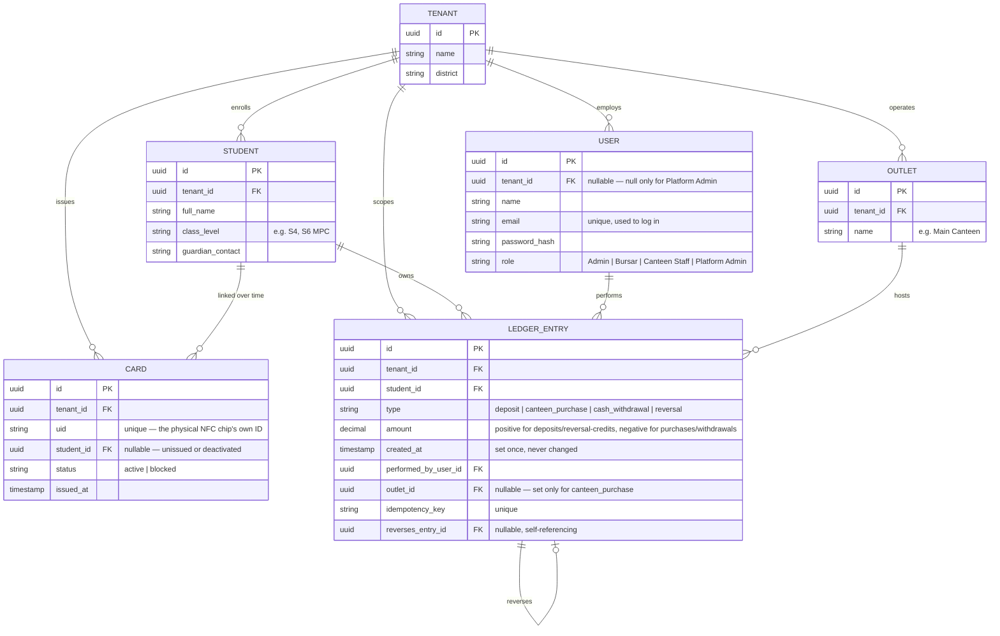

# ERD — Phase 1 (Pocket Money Module)

Source: ERD v1.0 (Sept 16, 2026), companion to SRS v1.1, PRD v1.0, SAD v1.0.

## Entities

### TENANT (School)
Represents one school using the platform. Every other entity belongs to exactly one tenant — this is what makes "one school's data is never visible to another" (SRS FR-8.1) enforceable at the data level, not just in application code.

### USER (Staff)
Any staff member who logs in: Director/Admin, Bursar, Canteen Staff, or Ubaka Tech Platform Admin. `tenant_id` is null only for a Platform Admin, who isn't tied to one school. `role` drives what the user can do (RAB v1.0 is the authoritative permission list).

### STUDENT
One record per enrolled student. Holds only what the Pocket Money module needs — full academic records stay in CAMIS, not here.

### CARD
One physical NFC card. Deliberately holds no balance and no student personal data (SAD Section 3.1) — it's an identity pointer only. `status` enforces SRS FR-1.4 (max one active card per student at a time).

**Design note (card replacement, FR-1.3):** when a card is lost, the old row's `status` is set to `blocked` and its `student_id` cleared, then a new `CARD` row is created linking the same `student_id`. The student's balance is untouched because balance is never stored on the card — it lives entirely in `LEDGER_ENTRY`.

### OUTLET
A point of sale within the school — the canteen today, potentially a shop or library later. Kept as its own table now, even with one outlet, because settlement summaries are per-outlet (FR-6.3) and future modules shouldn't force a redesign (NFR-8).

### LEDGER_ENTRY
**The single most important table in the system.** Every deposit, purchase, withdrawal, and reversal is one row here — rows are never updated or deleted after creation (FR-5.1). A student's current balance is not a stored number; it's calculated by summing this table's rows for that student, which is what makes the system auditable (NFR-6).

## Relationships

- One **Tenant** has many Students, Users, Cards, Outlets, and Ledger Entries — and every record in those tables belongs to exactly one Tenant. This is the mechanism behind multi-tenancy.
- One **Student** can have many Cards over time (if replaced after loss/damage), but only one active at once — enforced by `Card.status` plus application logic.
- One **Student** has many Ledger Entries — their entire financial history.
- One **User** performs many Ledger Entries over time.
- One **Outlet** is the site of many Ledger Entries (canteen purchases specifically).
- A **Ledger Entry** may optionally reference exactly one other Ledger Entry it reverses — self-referencing, used only for corrections/refunds (FR-5.2), never for ordinary transactions.

## Why balance is not its own column

A natural instinct is to give `STUDENT` a `balance` field that gets updated on every transaction. This design deliberately avoids that: if balance were a single mutable number, a bug, race condition, or missed edge case could silently push it out of sync with reality, with no way to reconstruct what went wrong. Deriving balance from summing `LEDGER_ENTRY` rows means the number shown on the dashboard is always provably correct — calculated fresh from a permanent, append-only history, never trusted as a cached value. Same event-sourcing idea as the SAD, expressed here as the actual table structure.
